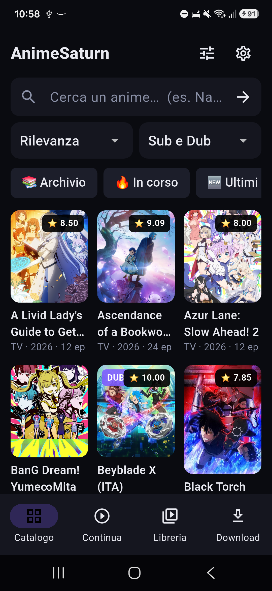
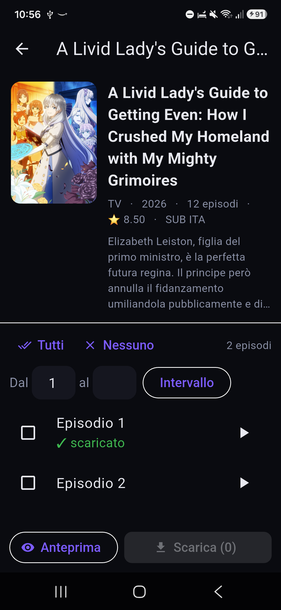
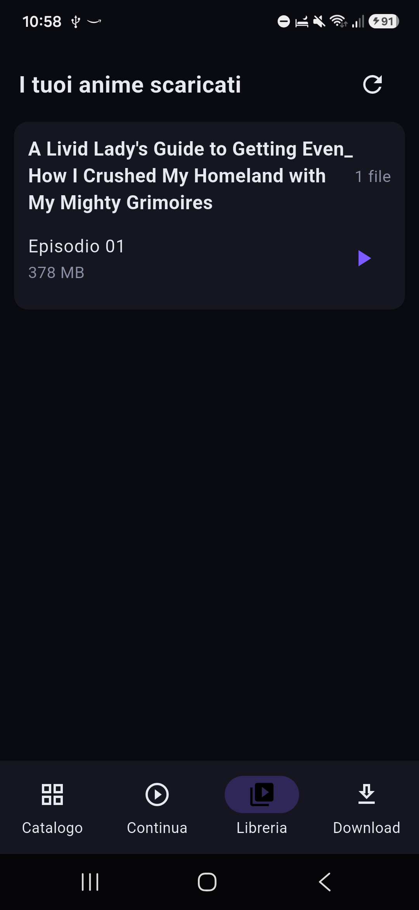
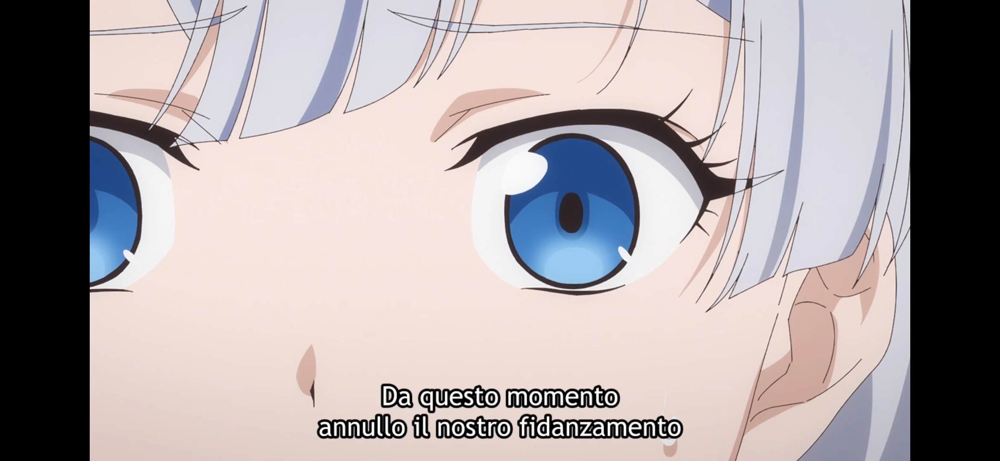
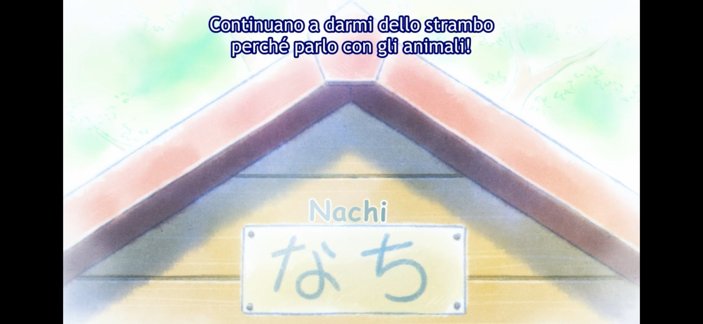

  

<h1 align="center">AnimeSaturn — App Android</h1>

  Guarda e scarica anime in italiano dal telefono. 
  Streaming integrato, download offline e ripresa da dove eri rimasto.

  
  

---

## 📸 Com'è fatta

  
  &nbsp;
  
  &nbsp;
  

  &nbsp;

## ✨ Cosa puoi fare

- **Cerca** un anime e ottieni i suggerimenti mentre scrivi.
- **Sfoglia** il catalogo: *Archivio*, *In corso*, *Ultimi aggiunti*, con **filtri**
  per genere, tipo, stato, stagione, lingua, anno e **Sub/Dub**.
- **Guarda in streaming** dentro l'app: schermo intero, **episodio successivo** e
  passaggio automatico alla puntata dopo.
- **Riprendi da dove eri rimasto** — l'app ricorda episodio e minuto, sia in
  streaming sia sui file scaricati.
- **Scarica gli episodi** (singoli, tutti o un intervallo) e guardali **offline**:
  coda con velocità, download simultanei regolabili, pausa e **ripresa** se
  l'interruzione ti lascia a metà.
- **Libreria** con tutto ciò che hai scaricato, pronta da riprodurre.
- Se il sito **cambia indirizzo**, l'app se ne accorge e si aggiorna da sola;
  in caso contrario puoi inserirlo a mano dalle Impostazioni.

## ⬇️ Come si installa

1. Apri le **[Releases](https://github.com/piciolo/animesaturn-apk-/releases/latest)**
   e scarica **`AnimeSaturn-*-arm64-v8a.apk`** (è quello giusto per praticamente
   tutti i telefoni moderni).
   *Solo per telefoni molto vecchi a 32 bit:* variante `armeabi-v7a`.
2. Apri il file scaricato sul telefono.
3. Android chiederà di consentire l'installazione da **origini sconosciute**:
   acconsenti e completa. Fine.

> Non arrivando dal Play Store, è normale che il telefono mostri un avviso: è la
> procedura standard per le app installate manualmente (*sideload*).

## 📱 Requisiti

- Android **7.0** o superiore
- Spazio libero per gli episodi che scarichi (indicativamente 300–500 MB l'uno)

## 💡 Consigli

- In orizzontale il video usa tutta l'altezza dello schermo; con il pulsante
  **Riempi** puoi allargarlo a tutto schermo (ritagliando i bordi).
- Se il catalogo non carica, apri **Impostazioni → Verifica ora**: l'app cerca da
  sola l'indirizzo aggiornato del sito.
- Attiva le **notifiche** se vuoi vedere l'avanzamento dei download.

## ⚠️ Note

App **non ufficiale**, non affiliata ad AnimeSaturn. Distribuita per **uso
personale**: rispetta le leggi sul diritto d'autore e i termini di servizio del
sito, e guarda o scarica solo contenuti per cui hai i relativi diritti.
Nessuna garanzia: usala a tuo rischio.

Attribuzioni e licenze dei componenti di terze parti: vedi **[NOTICE.md](NOTICE.md)**.
